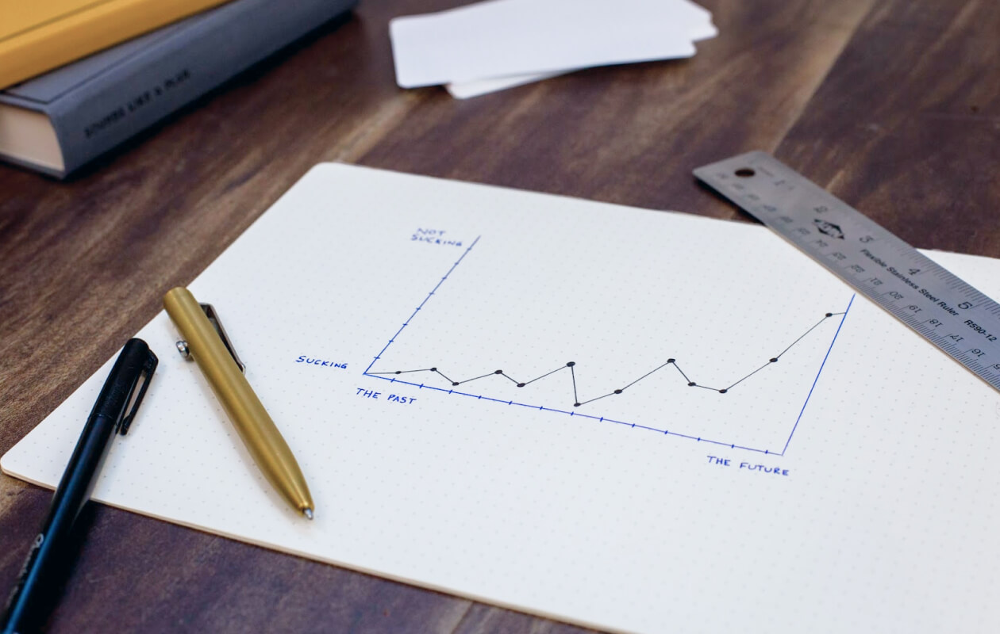
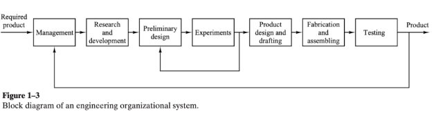
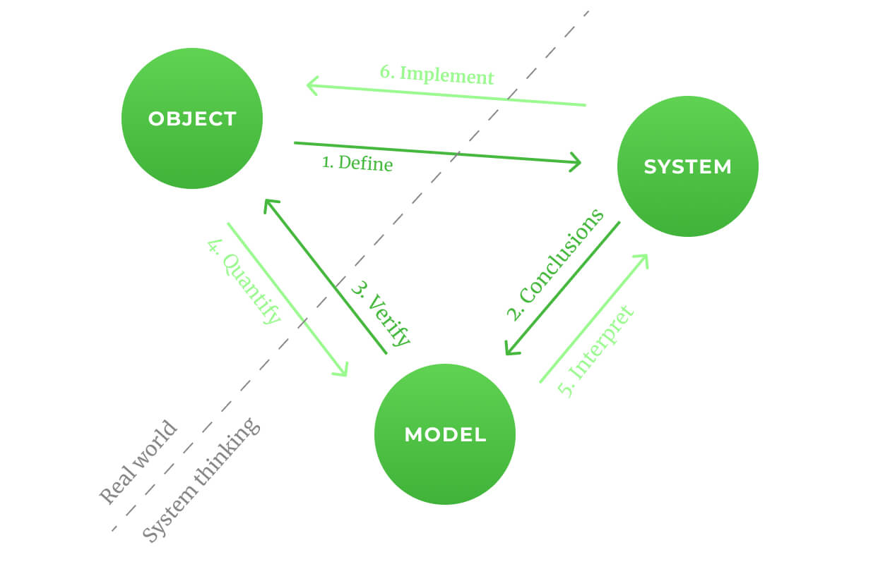
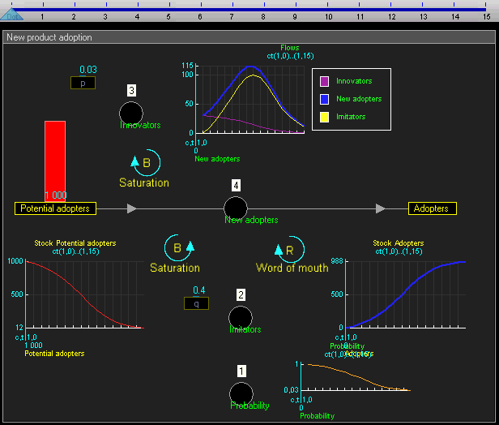
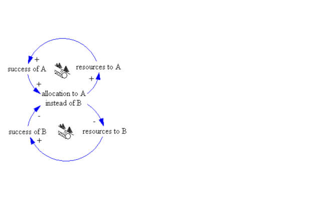
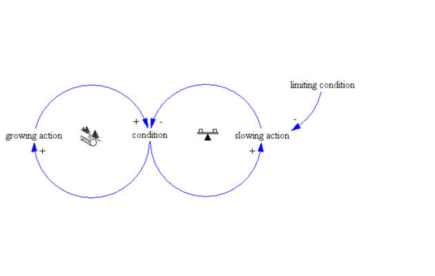
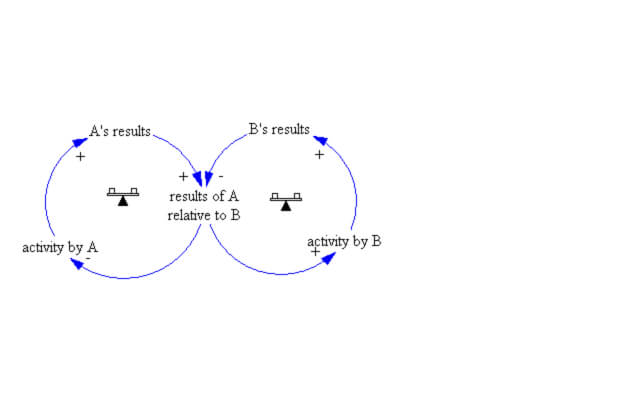
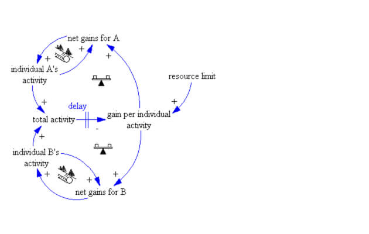
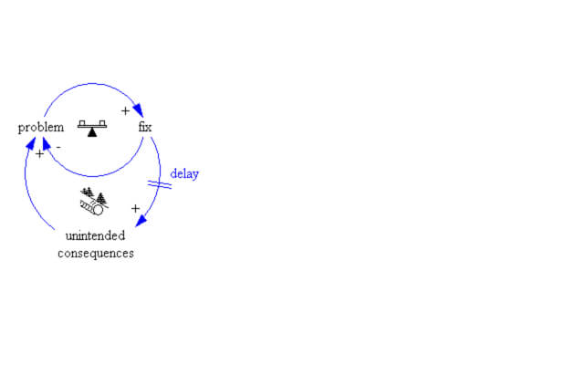

There are systems everywhere: cities, countries, planets, solar system, galaxy, universe, even reality can be imagined as a comprehensive system. Almost any physical object can be considered as a system.

Systems could be investigated by a scientific approach using various disciplines and methods, for example: systems theory, control theory (cybernetics, information theory), systems approach, system dynamics, and many other tools.

This article gives a brief overview of the phenomenon of systems, showing the advantages of system thinking, and attempts to interest the reader by pushing them towards independent study of system theory in any of its manifestations. At the end of the article, there is a list of books that are (were?) used for writing (the article?). Each book contains a list of references recommended by the authors for further immersion in the topic.

In the article we explain "What is a system?" and “What type of systems are there?”, discuss “System archetypes”, “Points of influence on the system” and talk about the problems and solutions of this sphere.

## What is a system?
A **system** is a set of elements and the connections between them, functioning as a whole to achieve a certain goal (purpose). Streams of information, matter, and energy can be transferred between the elements of the system. Each of the system elements is associated with at least one other system element.

> "A system is more than just the sum of its constituent parts. It can demonstrate different types of behavior: be dynamic, strive for some goal, to adapt to external conditions, to strive for self-preservation, to evolve ..." Meadows. The ABC of Systems Thinking

*Katsuhiko Ogata. Modern Control Engineering*

## What is not a system?
A collection of some objects that have no correlation or common purpose.

## What type of systems are there?
* **Closed vs. open** — depending on whether it interacts with the environment
* **Deterministic vs. stochastic** — depending on whether the system shows unambiguous or random (statistically descriptive) behavior
* **Static vs. dynamic** — depending on whether they evolve over time
* **Continuous vs. discrete** — depending on whether the values ​​change continuously or stepwise/divided
* **Soft vs. hard** — hard systems are associated with well-structured problems (solutions can be relatively easily algorithmized) - in soft systems there are a number of factors, their structure is not precisely defined, and data is indeterminate and incomplete

Systems could be also classified in different ways, for example, according to their complexity, which is defined by our subjective view/opinion.

**Static complexity** — a number of elements and/or the complexity of the relationships between them.

**Dynamic complexity** is not intuitive, complex connections between elements, delays, disproportionate reactions, feedback loops, etc.

## What is systems thinking?

**Systems thinking** is a hands-on approach to understanding the world that greatly accelerates the ability to analyze, make decisions, and learn.

Systems thinking makes it possible to understand by what principles the investigated object works, the conditions of its occurrence.

- A unique type of worldview using suitable methods and tools.
- An approach that allows us to refine and develop our own mental models, thus obtaining more reliable conclusions and predictions.
- The main tools of systems thinking: cause-effect diagrams (connections), which determine the behavior of the system in time.

## What is Model and Simulation?
A **model** is a deliberate simplification of reality that serves to easily understand a problem. **Modeling** is a process by which we cognize reality, and serves to study and display the properties of a real object.

*"System triangle" expresses the process of systems analysis*

Before continuing,  we need to look at one important definition.
**Feedback** is a process that leads to the result of the functioning of a system affecting the parameters on which the functioning of the system depends.

There is positive and negative feedback; negative feedback changes the input signal in such a way to counteract the change in the output signal, which makes the system more resistant to random changes in parameters - conversely, positive feedback amplifies the change in the output signal. Systems with strong positive feedback tend to be unstable, with sustained oscillations that can occur. In this case, the system becomes a generator.

## Systems theses

*Computer simulation example*

* The system influences itself through a feedback mechanism (loop) - it is a chain. *I'll make an assumption right away that we are talking about dynamic systems.*
* Any system has a number of mechanisms to maintain its integrity.
* From one system, another completely new one can arise which has never existed before.
* Some systems are capable of self-healing and self-organization.
* Many interconnections in systems are implemented through information flows.
* The least obvious part of the system - its purpose - has a defining influence on the behavior of the system. For example: lose or win.
* Buffers (levels) are the backbone of any system. These are those elements in the system that can be seen, felt, quantified or directly measured at any given time - they are present in the system in the form of buffers. Buffers and levels reflect the chronology of changes in flows in the system. (incoming and outgoing).
* If the sum of all inputs is greater than the sum of all outputs, the level or volume of the buffer will increase - this is a positive cycle. In this case, you can imagine it like a lake with underground sources.
* If the sum of all outputs is greater than the sum of all inputs, the level or buffer will decrease.
* If the sum of all outputs is equal to the sum of all inputs, the buffer will be unchanged; in such cases, a dynamic equilibrium is established at the level that was observed at the moment when the flows were equal. Buffers can be increased both by increasing inlet flows and by decreasing outlet flows.
* Buffers usually change slowly, even if the inputs and outputs are changing very rapidly. This leads to delays and serves as a kind of buffer in the system, softening external influences.
* Connections are realized through a set of decisions, rules, physical laws or actions that depend on the size of the buffer itself. A buffer change causes a flow change, which in turn causes a further buffer change, and so on.
* Lagging in the balancing feedback loop causes the system to oscillate. They are linear and nonlinear. For example, if changes are described non-linearly, then the behavior of the system is more difficult to predict. You may be familiar with the concept of *Just in Time*. The main idea of ​​the concept is if the production schedule is set, then it is possible to organize the movement of material flows in such a way that all materials, components and semi-finished products will arrive in the required quantity, in the right place and exactly on time for the production, assembly or sale of finished products. At the same time, insurance stocks that freeze the company's funds are not needed. It is also one of the basic principles of lean manufacturing.
* The balancing feedback loop to keep the margin constant must be adjusted to compensate for the persistent leaks that affect it, no matter in which direction they occur. Without such a correction, the system will miss the desired value, and the margin will reach either less or more, due to feedback delay.
* Boosting (positive) feedback loops spin themselves up, leading to exponential growth or reach out-of-bounds. For example, the automation of production leads to inevitable changes in the economy and social sphere. An example from history would be that the slave system was replaced by a feudal one, and the feudal one was replaced by a bourgeois one.

In the process of studying systems, people have identified system archetypes, also known as system traps, let's look at some of them.

## Several system archetypes

**1. Success to successful**
The two lines of business are competing for limited resources. The greater the success of one, the more generously this direction is supplied at the expense of the other.

**2. Limits to growth**
First rapid growth, which later slows down. Sometimes the decline seems incomprehensible. Example: A virus may continue to spread until it runs out of people to infect.

**3. Escalation**
This archetype could be seen as a non-cooperative game where both players suppose that only one of them can win, such as competition for limited resources (raw materials, customers, etc.). It appears wherever the positive results of one side have a negative effect on the other. Example: arms race.

**4. Tragedy of the commons**
People use shared and limited resources according to the needs of everyone. This benefits everyone at first, but the returns will begin to decline, which encourages more vigorous exploitation of these limited resources. The case ends with depletion or complete depletion of resources. Example: deforestation.

**5. Fixes that fail**
A solution that is effective in the short term has unintended consequences in the long term that require increasing the “dose” of the same solution. Example: Four Pests Campaign

Each archetype has its own "symptoms" and options for getting out of the prevailing circumstances, but we will designate points of influence common to any system.

## Places to Intervene in a System (in increasing order of effectiveness)

**12. Numbers**: Constants and parameters such as subsidies, taxes, and
standards

**11. Buffers**: The sizes of stabilizing stocks relative to their flow

**10. Stock-and-Flow Structures**: Physical systems and their nodes of
intersection

**9. Delays**: The length of time relative to the rates of system change

**8. Balancing Feedback Loops**: The strength of the feedback relative to
the impact they are trying to correct

**7. Reinforcing Feedback Loops**: The strength of the gain of driving
loops

**6. Information Flows**: The structure of who does and does not have
access to information

**5. Rules**: Incentives, punishments, constraints

**4. Self-Organization**: The power to add, change, or evolve a system
structure

**3. Goals**: The purpose of the system

**2. Paradigms**: The mind-set from which the system—its goals, structure, rules, delays, parameters—arises

**1. Transcending Paradigms**

## What is the problem and how to solve it?

A **problem** is the conditions and states that seem undesirable to us and require a solution. When solving, it is necessary to understand the basic aspects of this state and, based on this, determine the solution algorithm.

The process can be described in 6 steps.

1. Identify the problem
2. Define the problem
3. Choose a suitable solution strategy:
   * Trial and error 
   * Use a ready-made solution
   * Investigate the problem and understand how to solve it
   * Come up with your own solution
4. Use new information obtained during the research to solve the problem
5. Check how effective the chosen solution is
6. Evaluate the results

## Conclusion

People are constantly striving to simplify their lives by trying to predict the behavior of the real world, mastering new scientific methods and subjugating the world around them to their ideas. The previous century brought us computer technology, which increased our predictive power, allowed us to automate many processes and greatly influenced society.

The development of science brings a lot of opportunities for both good and evil. The machine is just a tool - humanity receives an effective set of mechanical slaves to carry out its labor. On one hand, such labor has many of the economic qualities of slave labor, although, unlike the latter, it is free from the demoralizing influence of human cruelty. 

On the other hand, any labor that accepts the conditions of competition using slave labor also accepts the conditions of slave labor, and thereby  essentially becomes a slave to the system it created. In this formula, the main concept is competition.

Finally, I want to give you a quote from the father of cybernetics Norbert Wiener to ponder:

> Perhaps it would be good for humanity if machines relieved it of the need to do dirty and unpleasant work. Or maybe it would be bad - I don't know. New opportunities cannot be approached in terms of the market, in terms of the money saved. There is only one way out - to build a society based on human values, other than buying and selling. Building such a society will require a lot of preparation and a big struggle, which, under favorable circumstances, can be carried out on the ideological plane, but otherwise - who knows how?

*Wiener. Cybernetics: Or Control and Communication in the Animal and the Machine*

## References
1. Wiener. Cybernetics: Or Control and Communication in the Animal and the Machine
2. Meadows. The ABC of Systems Thinking Meadows. Donella Meadows ABC of Systems Thinking
3. Stafford Beer. Brain Of The Firm