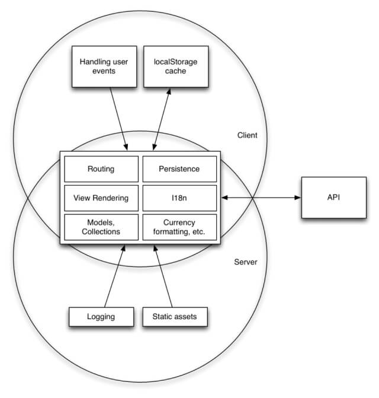

Companies and developers are always improving their web stack with an eye on the market trends and personal experience. In this article, we will discuss the front-end stack with that I have been working with for the last year and try to demonstrate its advantages in an arguable manner.

#### Who is the article for?

- Developers and/or companies who have not yet formed their opinion on the stack
- All interested and not indifferent

We choose React as the main front-end framework. Why? Because the framework is popular and occupies a leading position in the big three, for a company this means that there will be specialists on the market who can be hired. A simple example, if you are a front-end developer, then you have heard about the Svelte. It fundamentally solves the problem of unnecessary abstraction of virtual dom. But if we look at it from the business side, then we will understand that a developer for this technology simply cannot be found, for now :). React also has many libraries supported by the community and companies. For business, this means reducing the cost of developing their own solutions, and for the developers, convenience.

#### Why exactly React, but now from the developer's side

- JSX is cool
- Excellent IDE support
- React is well integrated with TypeScript (TypeScript supports embedding, type checking, and JSX conversion to JavaScript directly)
- React allows you to build the architecture that you need - the framework does not tell you anything about the model, controller, etc.

#### How does it work?

All front-end developers in our team use VS Code, this allows us to write the config once and never come back to it again. The config is in the root of the project ./.vscode/settings.json. Eslint and Prettier were also needed, with their help we maintain a single code style.

#### What else is interesting?

All our web applications are written in Typescript, we test with Jest and Cypress, and we choose Yarn as the package manager. After we have briefly talked about developer experience, we can move on to the project structure and specific libraries that we use in our daily work.

We use Razzle as a starting point, it allows us to create a universal JavaScript application with SSR with no configuration. Razzle uses Express, Webpack and Babel so we can easily plug-in the middlewares.

Our React apps are isomorphic. In an isomorphic application, most of the code should be shared - for both the client and the server side of the application. What for? How is it different from regular SSR or client rendering?

**SPA advantages:**

- Responsive interface in downloaded app
- Fast rendering in the loaded application
- Easy to cache

**Advantages of SSR:**

- Server sends to the client html, it’s good for SEO
- Client bundle smaller than SPA
- The ability to initialize an application with data prior to first display

**The isomorphic approach combines better:**

- Rendering the application on the server solves the “blank page” problem, which helps us with SEO
- On the client, instead of a spinning spinner, we immediately give the user access to the uploaded content, which improves our UX (optimistic response)
- On the server, we can immediately initialize the application with data, which allows us to get rid of unnecessary requests on the client

Basic approaches to creating an isomorphic application:

1. The general part of the application should not depend on the runtime environment (e.g. browser or node.js)
2. The functionality that depends on the runtime environment (for example, working with LocalStorage) should be placed in a separate module and included in the assembly for a specific runtime environment
3. App should have a common router for the client and server parts of the application, because rendering by URL on the client and on the server should give the same result
4. On the server side, there is no need for a reactivity system, because the server just generates static markup
5. Semantic layout is required, since hydrating the application (building the Virtual DOM and adding event handlers) an error may occur
6. As with the router, the libraries for the general part of the application must be isomorphic (moment.js, lodash, axios, etc.)
7. Isomorphic applications reduce server bandwidth

#### Basic project structure

- /
    - cypress/
    - public/
    - static/
    - typings/
    - src/
        - server/
        - graphql/
        - client/
            - pages/
            - context/
            - components/

#### GraphQL

We use GraphQL on the backend side and on the client side too - Apollo. 

GraphQL is not only about reading, it's about changing data. For this, there are mutations in GraphQL. Mutations are remarkable in that we can declare the desired response from the backend, upon successful change.

Auto-generated types, queries, mutations and fragments are in graphql/ directory.

**Advantages:**

- GraphQL is strongly typed and self-documenting
- Convenient on the client side because we decide what we need
- RESTful has a versioning issue. GraphQL implements an elegant solution for this - deprecated

On the frontend, GraphQL doesn't have that many drawbacks, because it was originally designed to solve frontend problems. And the backend is not so smooth. They have such a problem as N + 1.

There is also the problem of deep nesting. It is solved by splitting entities into separate Query. For example, you shouldn't nest everything in the User type, split some user settings to queries for ex. notificationSettings or subscriptions. In addition you can set a depth limit on the server with the help of the GraphQL depth limit package.

We generatete types with @graphql-codegen/cli.

We use Apollo only to interact with the backend, but not as a state manager. The state is either local or in exceptional cases it is the React Context API.

To work with forms, we use Formik + Yup. The classic react-router-dom serves as a router. To write styles, we had to sacrifice a drop of performance for the sake of speed and ease of development, styled-components does it's job.

#### What’s Next

I was happy to share our front-end stack with you. In the following articles, we will look at specific tools: TypeScript, GraphQL, and others. I hope that this will help you better navigate the architecture of web applications and find useful tools.

