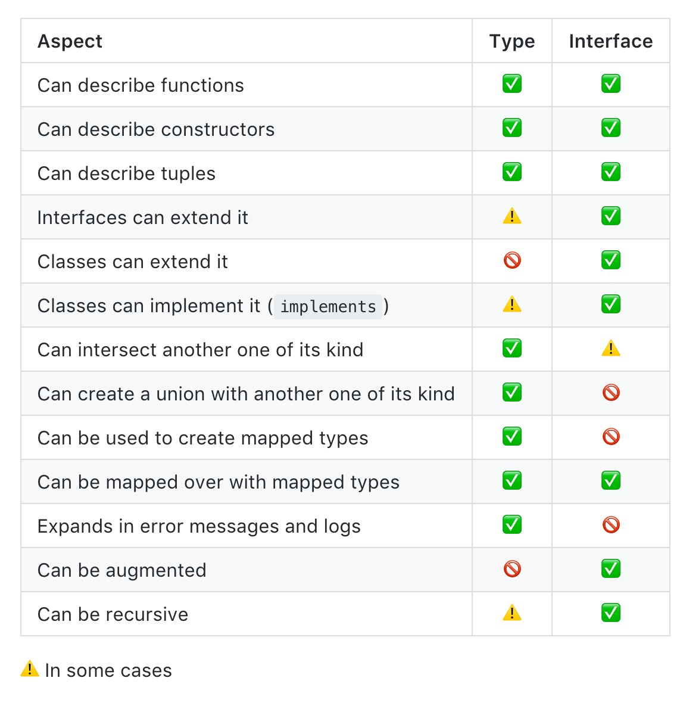

Companies and developers are always improving their web stack with an eye on the market trends and personal experience. In this article, we will discuss the front-end stack with that I have been working with for the last year and try to demonstrate its advantages in an arguable manner.

#### Who is the article for?

- Developers, who want to learn new things about TypeScript
- Devs & teams, who implement/use TypeScript
- All interested and not indifferent

#### What is TypeScript?

TypeScript (TS) is a superset of JavaScript (JS) syntax that is optionally typed and compiled (using *TSC* or *Babel*) to plain JavaScript. Technically, TS is statically typed JS.

> “Adopting TypeScript is not a binary choice, you can start by annotating existing JavaScript with JSDoc, then switch a few files to be checked by TypeScript and over time prepare your codebase to convert completely.”

Once compiled, the program can be run in any modern browser or used on a server (Node.js or Deno).

#### Why is TypeScript?

- Powerful type system, including generics, functions with optional parameters, functions with REST parameters, modules support and others
- Typing is very important because it helps to get rid of many compile-time errors, such as: ```undefined' is not a function```
- Types are optional: with TypeScript, we can make a huge improvement over plain JavaScript. It is easier to refactor code without breaking it significantly.
- TypeScript has excellent tooling, most modern code editors and IDLE support TS
- TypeScript evolves with standards: the TS team contributes to the TC39 committees which help guide the evolution of the JavaScript language. For example the TS team championed proposals like Optional Chaining, Nullish coalescing Operator, Throw Expressions and RegExp Match Indices.
- TypeScript makes code easier to read and understand
- TypeScript has good documentation

#### Tips for using TypeScript

Always prefer to specify the types of variables, parameters, and return values ​​to use the full power of TypeScript. This makes future refactoring easier.

*Most of the examples are demonstrated in the example of a React application.*

#### Required minimum of TypeScript

```typescript
type Props = {
  children: React.ReactNode;
}

interface Props {
  children: React.ReactNode;
}

enum Response {
  No = 0,
  Yes = 1
}

const color = {
    red: "red",
    blue: "blue"
};

// typeof and keyof operators
type Ex1 = typeof color; // { red: string; blue: string }
type Ex2 = keyof typeof color; // 'red' | 'blue'

// Utility Types Docs:
// https://www.typescriptlang.org/docs/handbook/utility-types.html
type Ex3 = Pick<typeof color, "red">; // { red: string };
type Ex4 = Omit<typeof color, "red">; // { blue: string };
type Ex5 = Partial<typeof color>; // { red?: string; blue?: string} 
type Ex6 = Record<"red" | "blue", number>; // { red: number; blue: number };

// Utilities to work with functions
const is = (x: string, y: number) => true;
type Ex7 = ReturnType<typeof is>; // boolean
type Ex8 = Parameters<typeof is>; // [string, number]
```

#### Tip 1: intolerance for mistakes

- Add type checking for dev mode.
- Add type checking to CI for every pull request.
- Optionally, you can add type checking on every commit.

```json
"scripts": {
    "typecheck": "tsc --noEmit",
    "lint": "tsc --noEmit && eslint '*/**/*.{ts,tsx}' --quiet --fix"
}
```

There are two main ways to compile ts files: original ```TSC``` and ```@babel```. The babel method is interesting in that information about types is stripped out from .ts files, due to which the assembly is fast.

#### Tip 2: use TypeScript aliases

Create prettier imports by defining paths and **baseUrl** properties to compilerOptions in ```tsconfig.json```

This will avoid long relative paths when importing.

```typescript
import { UserService } from "@services/UserService";
```

```json
"compilerOptions": {
    "baseUrl": "src",
    "paths": {
      "@services": ["services/*"]
    }
}
```

#### Tip 3: use any right

**First opportunity.**
You can disallow the use of any using the ```--noImplicitAny``` key for the tsc compiler, or add the noImplicitAny property to compilerOptions in ```tsconfig.json```.

**Second possibility to use alias.**
```typescript
export type TODO_ANY = any;
```

**Why do we use any?**
- complex code, urgent task
- efforts do not pay off

Sometimes it's better to use unknown instead of any

```typescript
const imUnknown: unknown = "hey";
const imAny: any = "hey";

imUnknown.toUpperCase(); // error: object is of type "unknown"
imAny.toUpperCase(); // Ok!
```

#### Tip 4: use never

- never is a good insurance against unprocessed cases.
- never in React: for example, you can prevent nesting or passing props:

```typescript
type Props = {
    size: "small" | "large";
    children?: never;
    onClick?: never;
};

const Icon: React.FC<Props> = () => <div>hey</div>;
    
const Component = () => (
  <>
    <Icon size="small">
      <div />
    </Icon> // error because pass children
    <Icon size="large" onClick={() => console.log("hey")}/> // error because pass onClick
  </>
);
```

#### Tip 5: types vs. interfaces

Use types when you need union or intersection. Use an interface whenever you want to use extends or implements. However, there is no hard and fast rule, use what works for you.

TypeScript 3.2 (Nov 2018):



#### Tip 6: do not use namespaces

Since we have ES6 modules as a standard in JavaScript, we don’t need custom TypeScript modules and namespaces. Instead, we should use standard JavaScript modules with import and export instead.

**Do not do this:**

```typescript
namespace Validation {
    export interface StringValidator {
        isAcceptable: (s: string) => boolean
    }

    export class LettersOnlyValidator implements StringValidator {
        isAcceptable(s: string) {
            // ...
        }
    }

    export class ZipCodeValidator implements StringValidator {
        isAcceptable(s: string) {
            // ...
        }
    }
}
```

**Do this**

```typescript
export interface StringValidator {
    isAcceptable: (s: string) => boolean
}

export class LettersOnlyValidator implements StringValidator {
    isAcceptable(s: string) {
        // ...
    }
}

export class ZipCodeValidator implements StringValidator {
    isAcceptable(s: string) {
        // ...
    }
}
```

#### Tip 7: override types that don't suit you

**When might you need it?**
- types are too general
- types contain errors
- the version of the types does not match the - version of the used library

```typescript
declare module 'isomorphic-cookie' {
    import { Request } from "express"
    interface Options {
        path?: string
        expires?: Date
        domain?: string
        secure?: boolean
        httpOnly?: boolean
    }

    function remove(name: string, options?: Options): void

    function load(name: string, request?: Request): string | undefined

    function save(name: string, val: string, options?: Options): void

    export { load, remove, save }
}
```

Typings are usually located in a separate directory ```typings/index.d.ts```
You can connect them in ```tsconfig.json```


#### Tip 8: use getters and setters

TypeScript supports the syntax of getters and setters. Using getters and setters to access object data is much better than accessing its properties directly.

**Why?**
- If you want to implement more than just property access, you need to change the implementation in one place, not throughout the code
- You can lazily load the properties of your object, for example, from the server
- Easily add logging and error handling at the getter and setter level
- Validation is easy to implement at the set implementation level
- Encapsulating internal state

```typescript
class Account {
  private balance: number = 0;

  get balance(): number {
    return this.balance;
  }

  set balance(value: number) {
    if (value < 0) {
      throw new Error("Cannot set negative balance");
    }

    this.balance = value;
  }
}
```

#### Tip 9: literal type vs enum

*with enum:*
```typescript
enum ColorE {
    red = "red",
    blue = "blue"
}

const ComponentE = (props: { color: Color }) => <div>{props.color}</div>;
```

*with literal type:*
```typescript
type ColorL = "red" | "blue";

const ComponentL = (props: { color: Color }) => <div>{props.color}</div>;
```

*both:*
```typescript
const Component = () => (
  <>
    <ComponentE color={ColorE.red} />
    <ComponentL color="blue" />
   </>
);
```

In this example, both components are checked for the color type. The enum version turned out to be more redundant - this is additional code during compilation, and additional imports in the source code. The string literal variant is more short and also contains type checking. There is no point in complicating the enum code.

**Prefer string literals for simple type checking.**

Use [enum](https://www.typescriptlang.org/docs/handbook/enums.html#const-enums) to describe more complex logic.

It is better to give preference to const enum(however this structure is not supported by babel, you will have to add a [plugin](https://www.npmjs.com/package/babel-plugin-const-enum)).

[Criticism of enum](https://stackoverflow.com/questions/49761972/difference-between-string-enums-and-string-literal-types-in-ts/54455743#54455743)

If you need to support runtime enums use following pattern:

```typescript
type EnumLiteralsOf<T extends object> = T[keyof T]

// ExpectType "RED" | "BLUE"
export type Color = EnumLiteralsOf<typeof Color>
// ExpectType Readonly<{ Red: "RED"; Blue: "Blue"; }>
export const Color = Object.freeze({
    Red: "RED" as "RED",
    Blue: "BLUE" as "BLUE"
})

const changeColor = (name: string, color: Color) => {
    // ...
}
```

#### Tip 10: use const assertions

as const tells the compiler that the given object will not change. Hence, you can deduce the types in more detail.

```typescript
const color = {
    red: "RED",
    blue: "BLUE"
} as const;

type ColorType = typeof color;
type ColorKey = keyof ColorType; // 'red' | 'blue'
type ColorValue = ColorType[ColorKey]; // 'RED' | 'BLUE'
```

You can also apply ```as const``` to arrays:

```typescript
const colors = ["RED", "BLUE"] as const;
type Color = typeof colors[string]; // "RED" | "BLUE"
```

#### Tip 11: branded types

[Brand](https://github.com/piotrwitek/utility-types#brandt-u) is the small utility for creating unique ("branded") types. Usually such types are created on the basis of primitive ones - strings, numbers.

```typescript
import { Brand } from "utility-types";

type USD = Brand<number, "USD">
type EUR = Brand<number, "EUR">

const tax = 5 as USD;
const usd = 10 as USD;
const eur = 10 as EUR;

function gross(net: USD): USD {
  return (net + tax) as USD;
}

gross(usd); // ok
gross(eur); // Type '"EUR"' is not assignable to type '"USD"'.
```

#### Tip 12: discriminated union

```typescript
type Color =
    | { type: "RED"; payload: string }
    | { type: "BLUE"; payload: number };

export const reducer = (state: State, color: Color): State => {
    switch (color.type) {
        case "RED":
            return { ...state, one: color.payload}; // `payload` is string
        case "BLUE":
            return { ...state, two: color.payload}; // `payload` is number
        default:
            return state;
    }
}
```

This creates a union of types with a common part. When working with such a union, the ts compiler can filter out variants and concretize the type.

#### Tip 13: use immutability

The type system in TypeScript allows you to mark individual properties of an interface/class as readonly fields. For more complex scenarios, there is a built-in type Readonly, which takes a type T and marks all of its read-only properties using mapped types (see mapped types).

```typescript
interface Config {
  readonly host: string;
  readonly port: string;
  readonly db: string;
}
```

```typescript
const handler = (args: readonly string[]) => {
  args.push(1); // error
}
```

```typescript
// object only for reading
const config = {
  property: "value"
} as const;
config.property = "new value"; // error

// array only for reading
const array  = [1, 3, 5] as const;
array[0] = 10; // error

// return object only for reading
const readonlyData = (value: number) => {
  return { value } as const;
}

const result = readonlyData(100);
result.value = 200; // error
```

#### Tip 14: use type for defining State or DefaultProps

```typescript
import React from "react"

// ExpectType Readonly<{ is: boolean; }>
type State = typeof initialState
// ExpectType { title: string; } & typeof defaultProps
type Props = { title: string } & typeof defaultProps

const initialState = Object.freeze({ is: false })
const defaultProps = Object.freeze({ title: "Hey" })

export class Example extends React.Component<Props, State> {
    static readonly defaultProps = defaultProps
    readonly state = initialState
}
```

Using **freezing** on ```initialState``` and ```defaultProps```, the type system will infer the correct readonly types.

**Why use type?**

- Using readonly and freezing, any change to the component will immediately result in a compile-time error
- Type information inferred from implementation
- Less boilerplate code describing types
- Well readable code

#### Conclusion

Using TypeScript in a project changes the way we write code. It becomes easier to understand refactoring  the code. You do not need to keep in mind the implementation details.

With new advantages come new challenges - maintaining the correct type system.

I hope these tips will help you to improve your system.
Of course, this is not a complete list, but it can serve as a good starting point.
