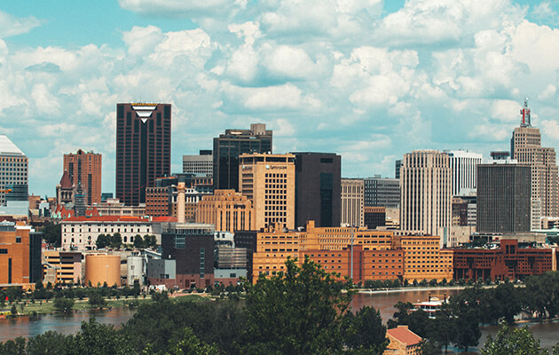

> The remark to the book: Terry Farrell, *The City As A Tangled Bank: Urban Design versus Urban Evolution,* 2013.

This article presents a historical, philosophical and sociological approach to the problems of the relationship between human life and the urban environment.

The characteristics of planning and cities development and also the person himself were changing during the various historical epochs. In modern conditions the growth rates of cities and the urban population obligate us to turn to the philosophical concepts of movement, space and time which, to a large extent, become fundamental for the practice of urban planning.

Urban development includes theory and practice of planning and building cities and it covers a complex set of socio-economic, environmental, aesthetic aspects of human existence [Kositskiy Ya.V. 2007, 76]. Since the industrial revolution, the city has been attracting more and more people by opening up to the new settlers many potential opportunities that are not found in rural areas.

The growth rate of the urban population exceeds twice the growth rate of the total number of inhabitants on the Earth. The fundamental definition of the urban reality is the philosophical categories of movement, space and time, on the basis of which the material, social and spiritual, including architectural, values of urban culture should be developed.

The relation between the concepts of motion, space and time was first noticed in Ancient Greece by the outstanding philosopher Aristotle [Nizhnikov S.A. 2012, 336]. His life and creative work due to the classic period - IV BC, when the philosophical ideas reached their apogee, and the successes of art and architecture of that period are admitted as the models of perfection. The ideals, values and the ideological paradigms materialize in the forms of the city. I fully agree with the author’s [Terry Farrell 2013] opinion about the significance of the “immersion” [Terry Farrell 2013, 179—184] in the socio-cultural, historical and geographical context of a particular city. After all, the only way we as architects and researchers can clearly grasp the essence, build relations, draw conclusions and come to an adequate action plan to achieve our goals.

I will give as an example the capital of the Czech Republic. Tourists used to associate Prague with ancient monuments, castles, palaces, narrow streets, the Charles Bridge ... it is City-tale, a city-history.

However, local residents, building companies, architects and designers, large corporations and financial groups believe that the Czech capital deserves also modern buildings, especially, skyscrapers, which can also fall into the "penny bank" of the best architectural creations of the 21st century over time.

It is not easy to build a skyscraper in Prague. The experts on the protection of monuments have been complaining of the absence of high-rise building rules for a long time. They also claim that the chaotic construction of skyscrapers spoils the views of Prague. There are many disputes over the intentions to build high-rise buildings in the Prague district of Pankrac. Previously, UNESCO has expressed a serious concern about this. The historical center of Prague was enlisted in the UNESCO Cultural Heritage List in 1992.

The “hotspot construction” is not accepted in the capital, but if it is planning to be done, the house that will be raised on a bare place or instead of a demolished building should correspond architecturally to its “surroundings”. Let it be by a modern design. A combination of classic and novelty often gives a stunning effect. However, a “sticking up” skyscraper in the middle of the street in the center of the city will threaten the historical context and the aesthetics of the city. The usual panorama will disappear, the atmosphere will be ruined.

This example shows us that when Urban Design and Urban Evolution [Terry Farrell 2013, 179—184] have some contradictions, and solution is not always on the surface, the cause includes not only the historical and the aesthetic value, but also an economic aspect.

Let's talk about space and time, but at first I will introduce the concept of the universal to understand the following definitions. The universal is an abstract unity of the objects according to a certain property or relation, thanks to which they are mentally combined into a certain set, class, genus, or species. The universal is a product of the activity of thinking. It is just an abstract concept in simple words [Hegel 1974, 118-119]. Rejecting the Hegelian interpretation of the universal as the creation of an absolute idea, the Marxism-Leninism classics showed that the category of the universal is a reflection of the truly universal. It is the objective unity of the diverse phenomena of nature and society in human consciousness. The universal is reflected objectively in thinking in the form of a system of concepts and definitions.

Philosophy defines space and time as the universal forms of matter being and of all the processes and phenomena being. Being is impossible without constant movement and change. The concepts of space and time are as tightly intertwined as the concepts of Urban Design and Urban Evolution [Terry Farrell 2013, 8—12], because the concept of Urban Evolution as a set contains a subset of Urban Design. I consider that the author should not have chosen the title “Urban Design versus Urban Evolution” for his work, because at least it may confuse or even scare the reader away.

The architects during their work on the planning of urban structures bring to the projects the ideas of spatial options which are dominate of this period of time. They also demonstrate a tendency towards the future and the desired perfection. Architecture as the most philosophical embodiment of urban planning in the principles of sustainability, statics, tectonics, reflection of structures in the artistic image includes the elements of movement as a concept of the historical time. From our point of view, the time - "now" is fixed, being embodied in the objects of the urban planning. Thus, the forms of architecture illustrate the inconsistency of time perfectly. But the architecture allows not only to perpetuate the past time - “now”, it is also able to represent the movement, the development and the sequence of events through the plasticity of the image.

Appealing to a person, to his material needs and the aesthetic taste, the practice of the antiquity urban planning provided for the organization of plain and clear space: a rectangular system of streets, a harmonious gridiron plan for building free sites, a lay-out of the city to the convenient quarters according to the professional activity, the elements of improvement and the allocation of community composition centers  [Wilson T., 175]. This practice began to spread very quickly in many countries of Europe and Asia. But in the Middle Ages there was a great change in ideas about space and time, which is reflected in the development of the cities. Under the domination of the Christian ideology, other priorities are put forward. Among them are: the creation of the world by God, which gave development in time, the ratio of the eternal, unchanging and current and the present. The primacy of the spiritual over the material is proclaimed. However, only practice or experiences are the criteria that can reflect the real and material world.

Due to the intensive development of scientific and technological progress, the spontaneous growth of the cities and the emergence of new spatial forms for unusual, previously unknown types of human activity there are dramatic changes in urban planning in the XIX-XX centuries. The industrial and administrative centers, highways, airports, train stations, entertainment and sports complexes are filling the urban areas. For the sake of economy it is necessary to abandon the historical classics, aesthetic traditions, humanistic orientation of architecture for the fast pace of building the objects of mass residential development. Urban relations are changing, the speeding time run manages to be captured in the typical residential buildings that recur in many cities, sometimes without taking into account the local climate and natural conditions. The territory of the cities is expanding, but the building density is constantly increasing, for example, there is three times less urban territory per Moscow resident than there is one St. Petersburg resident. According with the growth of the cities, the problems of the urban development become more and more complicated and it is becoming increasingly difficult to find any solutions.

In antiquity the focus of urban planning was a man. He owned the streets as an extension of personal space for meetings, communication, and exchange of ideas. Now the streets are owned by cars. There are less open spaces with good visibility prospects. On an unconscious level a closed space forms a feeling of abandonment, loneliness, isolation from the world and alienation from it. Even developing new urban areas, designers take into consideration the needs of the present time, forgetting about the opportunity which has been ripening in reality already and preparing to become a reality. Maybe, due to this fact the cities turn into the parking lots with a preserving shortage of space for personal cars [Azarenkova Z.V 2011, 49-50]. The concept of living environment doesn’t reduce itself to comfortable living space, the availability of a developed infrastructure and even a parking space. The spiritual values that the urban environment is called to form are becoming actual [Karabushchenko P.L. 2012, 2-11]. There is a great need for qualities of urban development that can fit into the context of the human factor, i.e. in the socio-psychological, visual, behavioral aspects of the perception of spatial objects.

Once again we come to the conclusion that architecture as a part of a human culture is only a reflection of reality, the current state of the economy, social interconnections in society and culture. I will cite an interesting illustration as an example: let’s recall the English sociologist and architect Ebnzer Hoord [Bonham-Carter E. 1951, 362–376], who in the early twentieth century expressed the idea of building a garden city. He means a city with a small number of inhabitants, low-rise buildings and huge open green areas that provide comfort and unity with nature for citizens. This project was attempted to be implemented in many European cities, but it was limited to some individual areas.

We can also refer to a more modern project which proposes to disassemble the "old" cities into the resources for the formation of certain conditions and social relations. The Venus project was created by an industrial engineer and designer, a futurologist and a social engineer Jacques Fresco. Jacques Fresco believed that the “Venus Project” [Jacque Fresco 1995] was an integral socio-economic system, in which automation and technology would be reasonably integrated into all public spheres with the aim of raising the standard of living rather than making a profit, in comparison with the modern system. The profit should stop playing the role of criterion for choosing solutions. Also, basing on the fact that man is a part of the environment, a new system of values of human existence is proposed (in accordance with the carrying capacity of the Earth), which would take care of the environment and all people, and also correspond to the nature of human needs. Fresco considered these ideas quite realizable and practical. Adhering to an integral approach to the problems, Fresco believes that the realization of goals and proposals on a local, not the worldwide, scale will lead the humanity to the doubling of previously committed mistakes and faults.

The project of the garden city, the Venus project as the others utopian projects of that period of time, which are not completely or even completely unrealizable, are not useless yet. The utopias are born where the acute social contradictions have appeared. Such projects are created to draw attention to these internal contradictions. Unfulfilled plans awaken the architects’ flight of fantasy, their desire to realize a classical principle of the proportion between benefits, endurance and beauty.

**References**
1. Kositskiy Ya.V., Blagovidova N.G. *Osnovy teorii planirovki i zastroyki gorodov (Fundamentals of the Theory of Planning and Development of Cities).* Moscow, Arkhitektura-S Publ., 2007, 76 p. 
2. Nizhnikov S.A., *Istoriya filosofii (History of Philosophy).* Moscow, INFRA-М Publ., 2012, 336 p.
3. Terry Farrell, *The City As A Tangled Bank: Urban Design versus Urban Evolution,* 2013.
4. Hegel, *The Logic of Hegel: Encyclopaedia of the Philosophical Sciences with Prolegomena,* 1974, 118-119
5. Wilson, T. *The Oglethorpe Plan,* p. 175
6. Azarenkova Z.V. *Transportnaya sostavlyayushchaya sotsial’nykh standartov kachest-va zhizni v gradostroitel’stve (Transport Constituent of Social Standards of the Quality of Life in Urban Development). Zhilishchnoe stroitel’stvo (Residential Housing Construction).* 2011, no. 8, pp. 49—50. 
7. Karabushchenko P.L. *Ideya lichnosti v razvitii cheloveka (The Idea of Personality in Development of Man). Vestnik Rossiyskogo filosofskogo obshchestva (Bulletin of the Russian Philosophical Society).* 2012, no. 2(62), pp. 60—66
8. Bonham-Carter, E 1951, *'Planning and development of Letchworth garden city' (Town Planning Review),* vol. 21, no. 4, pp. 362–376.
9. Jacque Fresco, *The Venus Project: The Redesign of Culture.* Venus, Florida: Global Cyber-Visions. 1995.